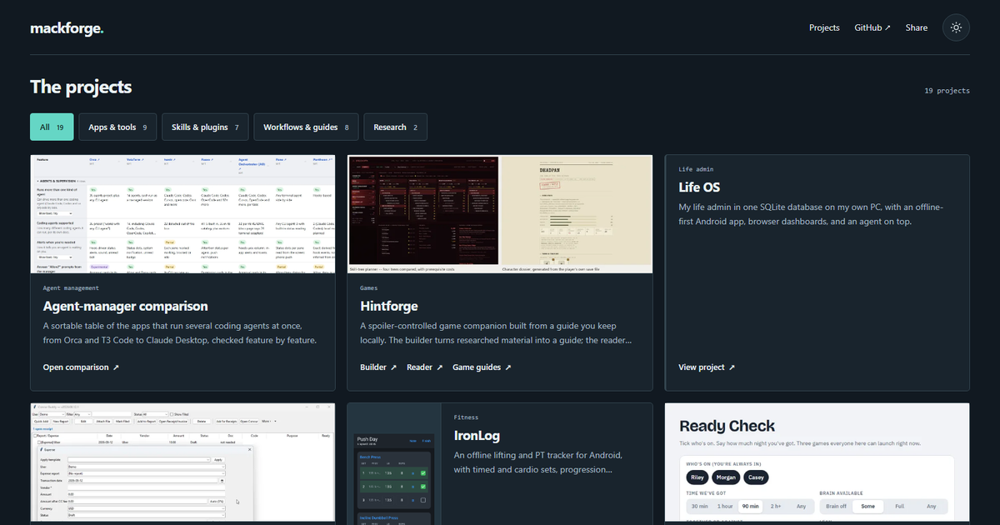

# mackforge

Apps, skills, and practical systems I built with coding agents for my own use, collected at [mackforge.dev](https://mackforge.dev/).

Browse by project type, filter by topic or platform, or search by name and what the project does. The small theme button switches between the dark workbench and a light green palette, and remembers your choice on this device.

It is plain HTML, CSS, and a small script, with no framework or build step, served by GitHub Pages. The full project list remains readable with JavaScript disabled.

## Files

- `index.html` is the whole site.
- `style.css` is the stylesheet for both themes.
- `site.js` handles search, filters, theme choice, and sharing.
- `CNAME` tells GitHub Pages which domain to serve.
- `.nojekyll` tells GitHub Pages to serve the files as they are, without running Jekyll.

## Updating it

The project list is written in `index.html`. Each project has a description, descriptive tags, compatibility labels, and links to its published work. Hintforge is one entry with separate Builder, Reader, and Game guides links.

When adding a project, update its article's filter data and the relevant topic/platform options. The script derives displayed counts from the articles. The agent-manager comparison is the first card in the list, followed by Hintforge; both respond to the filters like every other card. A wide screenshot sits above its card's text; give an article the `portrait` class when its screenshot is a tall phone screen, so the image stays beside the text instead.

Open `index.html` in a browser to preview. There is nothing to install.
