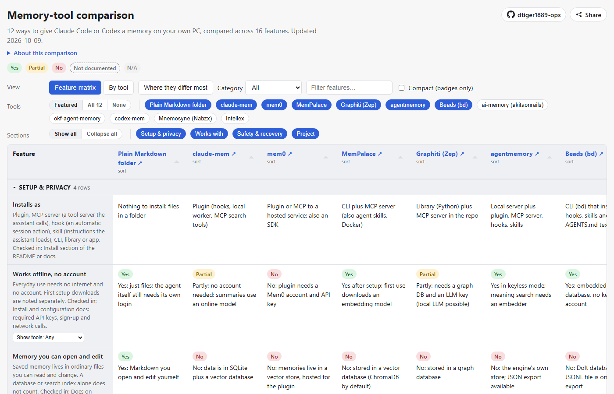

# Memory-tool comparison

A public, sortable comparison of memory tools for people using Claude Code or Codex on their own
computer: what each one installs as, whether it works offline, whether you can read and edit what it
saves, which assistants it supports, and what happens when something goes wrong. A plain folder of
Markdown notes sits in the first column as the baseline.

Live page: https://mackforge.dev/charts/memory-tools/

Sister chart: [agent-manager comparison](https://mackforge.dev/charts/agent-managers/).

## How the cells were filled

Every cell comes from the tool's own documentation (README, docs site, releases page, license) on the
date shown. Nothing was installed or tested, so a Yes means the docs say so. **Not documented** means
the docs were checked and are silent, which is not the same as a confirmed **No**. Footprint is an
estimate from the dependencies each tool's docs list, never a measurement. Each row's description
says where it was checked.

## How to view it

Open `index.html` in a browser, or serve the folder with any static file server, e.g.
`python -m http.server 8080`, then visit `http://localhost:8080/`.

## Data files

- `data/chart.json`: the feature rows (`key`, `label`, `description`, `group`, `how_checked`), the
  section order and the tool order.
- `data/tools/<id>.json`: one file per tool: `name`, `url`, `category` (`memory tool` or
  `baseline`), `description`, `checked_on`, `source_note`, `is_baseline`, and `features`, a map of
  feature key to `{ value, mark }`. `mark` is one of `yes`, `partial`, `experimental`, `planned`,
  `no`, `undocumented` (Not documented), `unknown`, `n/a` or `info` (a plain fact shown without a badge).
- `data/tools.json`: what the page loads, assembled from the files above by
  `python tools/build_data.py`. The script reads only the tools `chart.json` lists and refuses to
  write a chart that still has Unknown cells.

## License

MIT. See `LICENSE`.
